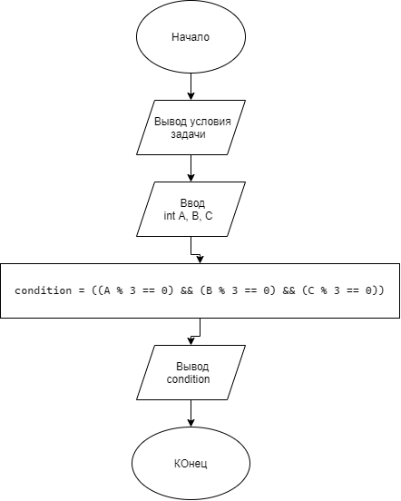

# Домашняя работа №4 (Вариант 20)

## Условие задачи

**20. Три кристалла**  
Чтобы открыть портал, необходимо зажечь три древних кристалла. Кристалл загорается, если переданная ему энергия (\(A\), \(B\), \(C\)) кратна трем. Портал откроется только в том случае, если загорятся все три кристалла.

---

## 1. Алгоритм и блок-схема

### Алгоритм

1. Объявить целочисленные переменные `A`, `B`, `C` для хранения энергии кристаллов и `condition` для результата проверки.
2. Настроить локализацию для корректного вывода русского текста.
3. Вывести на экран условие задачи.
4. Запросить у пользователя ввод трех чисел через запятую.
5. Проверить условие: кратны ли все три числа трем одновременно (`(A % 3 == 0) && (B % 3 == 0) && (C % 3 == 0)`). Записать результат (1 или 0) в переменную `condition`.
6. Вывести результат проверки доступа к порталу (1 — да, 0 — нет).
7. Завершить программу.

### Блок-схема




---

## 2. Реализация программы

## 3. Результаты работы программы
```
Домашняя работа № 4:
20. Три кристалла
Чтобы открыть портал, необходимо зажечь три древних кристалла. Кристалл загорается, если переданная ему энергия(A, B, C) кратна трем. Портал откроется только если загорятся все три кристалла

Введи энергию в формате: A, B, C: 3, 6, 9
Доступ открыт (1 - да, 0 - нет): 1
```

---

## 4. Информация о разработчике

- **ФИО:** Лавлинский Алексей Евгеньевич
- **Группа:** бОТИ-261, 2п/г
